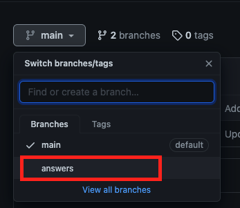

# CSM Hands on Activity

In this activity, we will walk through the process of identifying CircleCI features in a `config.yml` file and look for areas of optimization. 

## How to use this README

There are two branches to this file, the main branch and the answers branch. The main branch will give instructions for viewing config files and questions associated with the file. 

To view answers and possible optimization ideas, switch to the answers branch. 

## Prereqs 

- Permission to view customer config files and builds
- Completion of the CSM training in CircleUP titled "Filler"

## Viewing Customer Configuration Files 

There are several ways to view customer config files. 

- On the Dashboard, through the "three dots"

- While viewing a workflow

- While viewing a job

- From the Projects page

- From the Insights page, when viewing a Workflow
          

The ability to view config from several locations makes jumping to viewing config easy, depending on what you may be doing. If you are troubleshooting a specific workflow, you can switch to the config quickly. If you are working on optimization by viewing insights, you can easily view the associated configuration file, etc.

### Viewing Older Configuration Files

When viewing config, CircleCI will also alert you if the config file you are viewing is out of date, as seen below. 

## Customer Examples

Let's look at a few simple example configs and where we might suggest optimizing the config. Some config files can be overwhelming with their size. An easy way to sift through the config is to `command/control + f` and search for keywords.

### Example 1

For this first example we will practice identifying what CircleCI features are being used in the build. Navigate to this [customer build](https://app.circleci.com/pipelines/github/ethereum/remix-project/6479/workflows/6951972b-3edf-47ee-9345-45dce4d2f9a6). 

Here we are viewing a completed workflow. This was a successful build that completed in 21m47s. 

#### What can we identify from this workflow page? 

1. Is this customer running concurrent jobs? 

- [ ] Yes
- [ ] No 

#### Review the Config

Let's hop into the config. Remember from above how to view a config from the workflow. 

2. Is this configuration file the most current version? 

- [ ] Yes
- [ ] No

Locate the `version` key. 

3. What version of CircleCI is being used? 

- [ ] version 2.1
- [ ] version 2
- [ ] version 1

4. Is this customer utilizing orbs? 

- [ ] Yes
- [ ] No

Next let's identify what type of executors are being used in this configuration. Each job in a circleci config needs to have an executor associated with it. Executors can be defined using an `executor` key at the top of a config file (requires version:2.1), and then referenced in a job later, or defined in a job iteslf. 

In this customer example, a docker executor is being used in the job titled `remix-libs`. 

5. Are they using a custom image, or a CircleCI convenience image? 

- [ ] A legacy CircleCI convenience image
- [ ] A next-gen CircleCI convenience image
- [ ] A custom image from dockerhub

**Next, let's jump into a fun topic, parallelism and test splitting!!!**

There are several ways to identify if a customer is testing, splitting their tests, and uploading their test data. Since we have been viewing a config file, let's start there. Navigate to this [customer config file](https://app.circleci.com/projects/github/maalox/digihaler-flutter/config/?branchName=master&pipelineNumber=12673). 

The first step is to identify if a customer is testing as part of their pipeline. One easy way to do that is to search for the work `test`. 

6. How many instances of the word "test" are in this file? 

- [ ] 40
- [ ] 63

Excellent. We see that this customer is indeed testing. Next, is this customer utilizing parallelism and test splitting? Let's search for `parallelism`. We can see there are two instances of the parallelism key.

7. For each of these keys, what level of parallelism is being used? 

- [ ] 10
- [ ] 8
- [ ] 4

Recall from the CircleUp courses that parallelism and test splitting go hand in hand. Now that we have seen the parallelism key, search for the CircleCI CLI to see how these tests will be split across the nodes. 

8. From your search, how are these tests being split? (Hint: try searching for `circleci`).

- [ ] Timing Data
- [ ] File Size
- [ ] File Name

### Example 2

Let's jump to another config file and look for some areas of optimization. Navigate to [this](https://app.circleci.com/projects/github/mysugr/logbook-android/config/?branchName=develop&pipelineNumber=30890) config file. 

1. Looking at line 1 of this config file, what is different than previous config files? 

- [ ] No version key? 
- [ ] Using an old version of CircleCI

Next, let's figure out if this customer is building their own docker images. Customers are often building their own docker images when their application or product is deployed using container technology. This includes the pushing and building of these containers that their product consists of. Try searching for docker compose or docker build commands by searching for the word `docker`. 

2. What is the name of the job that contains one of these commands? 

- [ ] manuals_generate
- [ ] assemble_alpha

3. Looking at this job and thinking back to earlier training, what might you suggest to optimize this job? 

- [ ] They are already using docker layer caching, so using a parameters key.
- [ ] Definitely docker layer caching
- [ ] Dependency caching
