# CSM Hands On Activity

In this activity, we will walk through the process of identifying CircleCI features in a `config.yml` file and look for areas of optimization. 

## Prereqs 

- Permission to view customer config files and builds
- Completion of the CSM training in CircleUP

## Viewing Customer Configuration Files 

There are several ways to view customer config files. 

- On the Dashboard, through the "three dots"

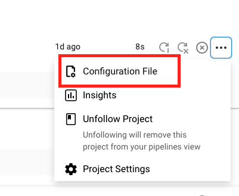

- While viewing a workflow

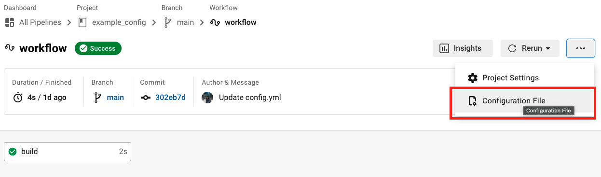

- While viewing a job

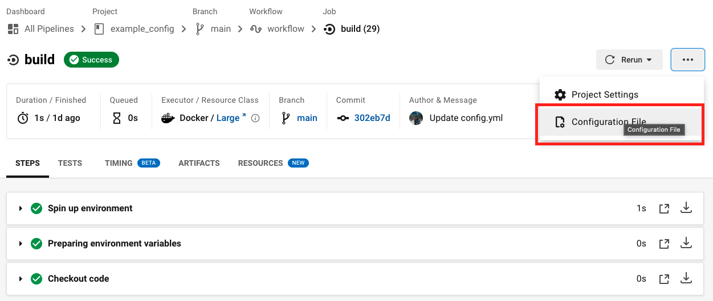

- From the Projects page

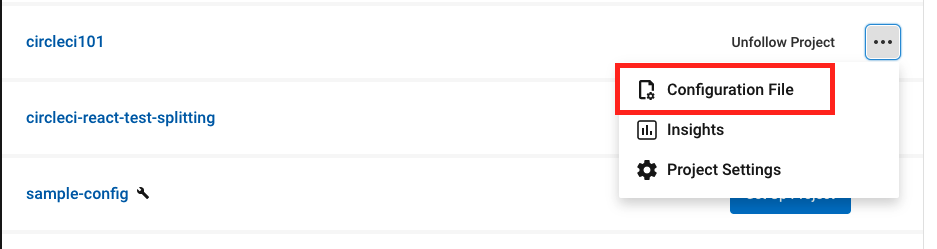

- From the Insights page, when viewing a Workflow
          
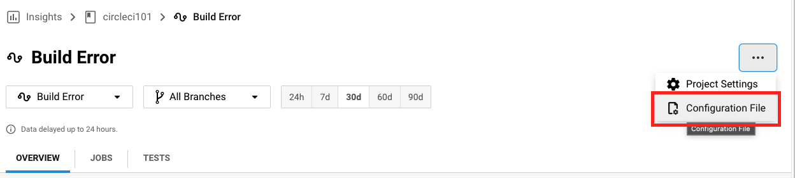

The ability to view config from several locations makes jumping to viewing config easy, depending on what you may be doing. If you are troubleshooting a specific workflow, you can switch to the config quickly. If you are working on optimization by viewing insights, you can easily view the associated configuration file, etc.

### Viewing Older Configuration Files

When viewing config, CircleCI will also alert you if the config file you are viewing is out of date, as seen below. 

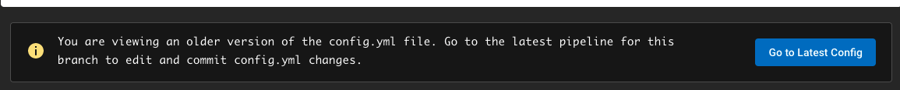

## Customer Examples

Let's look at a few simple example configs and where we might suggest optimizing the config. Some config files can be overwhelming with their size. An easy way to sift through the config is to `command/control + f` and search for keywords.

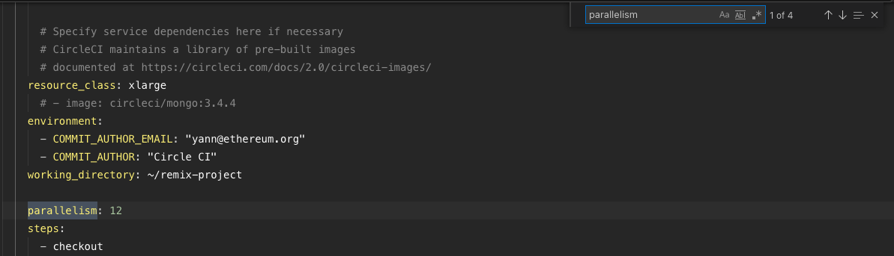

### Example 1

For this first example we will practice identifying what CircleCI features are being used in the build. Navigate to this [customer build](https://app.circleci.com/pipelines/github/ethereum/remix-project/6479/workflows/6951972b-3edf-47ee-9345-45dce4d2f9a6). 

Here we are viewing a completed workflow. This was a successful build that completed in 21m47s. 

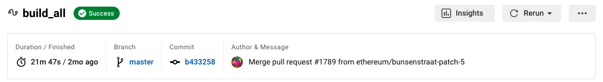

#### What can we identify from this workflow page? 

1. Is this customer running concurrent jobs? 

- [x] Yes
- [ ] No 

You can tell that this customer is using concurrency from the workflow page. Jobs publish -> remix-libs are running concurrently. 

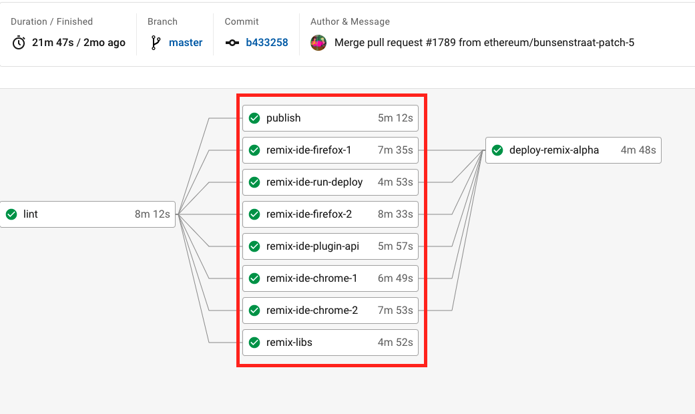

#### Review the Config

Let's hop into the config. Remember from above how to view a config from the workflow. 

2. Is this configuration file the most current version? 

- [ ] Yes
- [x] No

You will see at the top that "You are viewing an older version...".

Locate the `version` key. 

3. What version of CircleCI is being used? 

- [ ] version 2.1
- [x] version 2
- [ ] version 1

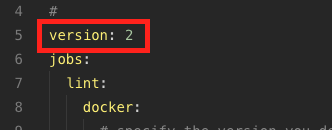

In this case, the customer is using an older version of CircleCI at version: 2. In this scenario, it may be worth asking questions around why they are not on the current version and the benefits of upgrading. A big benefit of 2.1 is [reusable config](https://circleci.com/docs/2.0/reusing-config/). 

4. Is this customer utilizing orbs? 

- [ ] Yes
- [x] No

By searching the configuration file, it can be seen that there are no orbs in use. We know this because there is no usage of the `orb` key. Here, you can ask questions about repeating configuration, and if they have certain yaml that they use over and over. If so, point them in the direction of using [orbs](https://circleci.com/developer/orbs). (Private or public). 

Next let's identify what type of executors are being used in this configuration. Each job in a circleci config needs to have an executor associated with it. Executors can be defined using an `executor` key at the top of a config file (requires version:2.1), and then referenced in a job later, or defined in a job iteslf. 

In this customer example, a docker executor is being used in the job titled `remix-libs`.

5. Are they using a custom image, or a CircleCI convenience image? 

- [x] A legacy CircleCI convenience image
- [ ] A next-gen CircleCI convenience image
- [ ] A custom image from dockerhub

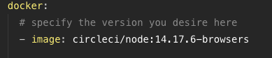

All convenience images with the prefix "circleci" are now deprecated. It is recommended to use next-generation images when possible. For a list of the latest next-gen convenience images and details about the content of each image, visit the [Developer Hub](https://circleci.com/developer/). [Here](https://circleci.com/blog/announcing-our-next-generation-convenience-images-smaller-faster-more-deterministic/) is a great blog article about the next-gen images.  

**Next, let's jump into a fun topic, parallelism and test splitting!!!**

There are several ways to identify if a customer is testing, splitting their tests, and uploading their test data. Since we have been viewing a config file, let's start there. Navigate to this [customer config file](https://app.circleci.com/projects/github/maalox/digihaler-flutter/config/?branchName=master&pipelineNumber=12673). 

The first step is to identify if a customer is testing as part of their pipeline. One easy way to do that is to search for the work `test`. 

6. How many instances of the word "test" are in this file? 

- [ ] 40
- [x] 63

Looking through the results of the search, you can see there are a few jobs that are testing. 

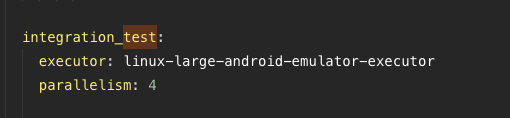

Excellent. We see that this customer is indeed testing. Next, is this customer utilizing parallelism and test splitting? Let's search for `parallelism`. We can see there are two instances of the parallelism key. 

7. For each of these keys, what level of parallelism is being used? 

- [ ] 10
- [ ] 8
- [x] 4

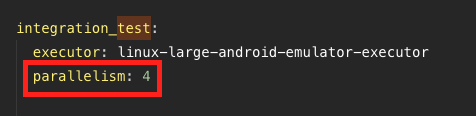

These tests are beings split between 4 nodes (containers). 

Recall from the CircleUp courses that parallelism and test splitting go hand in hand. Now that we have seen the parallelism key, search for the CircleCI CLI to see how these tests will be split across the nodes. 

8. From your search, how are these tests being split? (Hint: try searching for `circleci`).

- [x] Timing Data
- [ ] File Size
- [ ] File Name

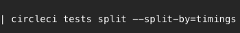

Here, we can see that the customer is splitting their tests by timing data as indicated by the CircleCI command line. This is the best way to split tests and is only possible if they are also using the `store_test_results` key. For a review on the different ways to split tests with the CLI, see [Running Tests in Parallel](https://circleci.com/docs/2.0/parallelism-faster-jobs/#running-split-tests). 

### Example 2

Let's jump to another config file and look for some areas of optimization. Navigate to [this](https://app.circleci.com/projects/github/mysugr/logbook-android/config/?branchName=develop&pipelineNumber=30890) config file. 

1. Looking at line 1 of this config file, what is different than previous config files? 

- [x] No version key? 
- [ ] Using an old version of CircleCI

This config file does not have a version key on line one, but does have a version key. In this case, they are using the commands key, which is only available at version: 2.1. This can be found down on line 1035. In YAML, order does not necessarily matter. 

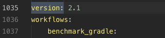

Next, let's figure out if this customer is building their own docker images. Customers are often building their own docker images when their application or product is deployed using container technology. This includes the pushing and building of these containers that their product consists of. Try searching for docker compose or docker build commands by searching for the word `docker`. 

2. What is the name of the job that contains one of these commands? 

- [x] manuals_generate
- [ ] assemble_alpha

3. Looking at this job and thinking back to earlier training, what might you suggest to optimize this job? 

- [ ] They are already using docker layer caching, so using a parameters key.
- [x] Docker layer caching
- [ ] Dependency caching

To first tell if a customer is using DLC, search for the `docker_layer_caching: true` key. From searching, we see that there is no usage of this key, and therefore they are not using DLC. 

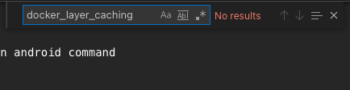

**How to know if DLC is appropriate?**

Note that DLC will only reduce the time it takes to build your own Docker images with docker build, docker compose, or similar docker commands in a remote Docker environment. It does not affect the time it takes to spin up the primary Docker container. If you are running your pipelines in a Docker container but not building new images as part of your workflow, then you will not see any reduction in build times by implementing DLC.

Since we have seen that this config utilizes docker compose, it is worth suggesting DLC by adding the `docker_layer_caching: true` key under the job. 
